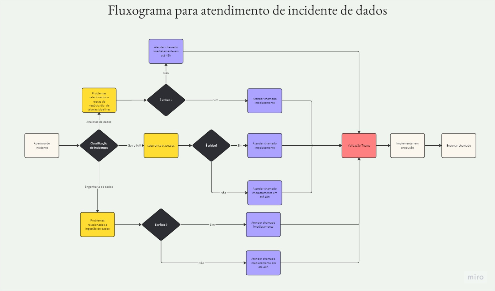

# Projeto do MBA de Engenharia de Dados

## Projeto de previsão de fraude em transações financeiras

Este projeto tem por finalidade compor parte da avalição das disciplinas de Dados E Analytics nas Organizações, Data Lakes, Lakehouses e Datas Meshes, Governança de Daddos e Hands-on Fundamentos de Ddos e Analytics do curso de MBA em Engenharia de Dados.
O projeto consiste em criar um modelo de previsão de fraudes em transações financeira, e, para isso foram realizados os seguintes passos:

- Automação do processo de extração de arquivos CSV disponíveis na plataforma de dados Kaggle;
- Armazenamento do dataset em um datalake no Google Cloud Storage;
- Ingestão do daods em uma tabela no google BigQuery;
- Criação de modelagem dimensional e separação de camadas utilizando o DBT;
- Criação do modelod de previsão de fraudes;
- Dashboard no Power BI.

### Integrantes
| Nome                 | Função                                              |
|----------------------|-----------------------------------------------------|
| Fabio Emanoel        | Analista de dados                                   |
| Lais Helena          | Engenheira de Machine Learn                         |
| Neoaquison Medeiros  | Engenheiro de dados e Governaça de dados            |
| Tainá Costa          | Product Manager e Analista de dados                 |

## Empresa
<!--  -->

# Mack Financial Solutions

##### Estratégias de Detecção e Prevenção de Fraudes com Cartão de Crédito
Indicadores Chave de Performance (KPIs) e Objetivos e Resultados Chave (OKRs)

A Mack Financial Solutions é uma empresa especializada em combater fraudes com cartão de crédito, oferecendo soluções inovadoras através de tecnologias avançadas como Machine Learning. Nosso foco é desenvolver algoritmos robustos para detecção precoce de fraudes, minimizando perdas financeiras e mantendo alta satisfação do cliente. Monitoramos nossa eficácia por meio de KPIs rigorosos e estabelecemos OKRs claros para orientar nossas melhorias contínuas.

## Estratégia de Dados e Governança da Mack Financial Solutions
1. Visão Geral
- A Mack Financial Solutions reconhece a importância crítica dos dados na era digital para impulsionar a inovação, melhorar a eficiência operacional e fortalecer a relação com os clientes. Esta estratégia de dados e governança tem como objetivo estabelecer um framework robusto para a gestão, uso e proteção dos dados, alinhando-os com as iniciativas estratégicas de negócios.

2. Objetivos Estratégicos
- Redução de Fraudes: Implementar soluções de dados avançadas para detectar e prevenir fraudes com cartão de crédito, minimizando perdas financeiras.
- Experiência do Cliente: Utilizar insights de dados para personalizar a experiência do cliente, aumentando a satisfação e a retenção.
- Eficiência Operacional: Otimizar processos internos através da análise de dados para reduzir custos e melhorar a produtividade.

3. Estratégia de Dados

- Formação da Equipe de Estratégia de Dados
Constituir uma equipe multidisciplinar com representantes da alta gerência, análise de negócios, IA e TI para liderar a implementação da estratégia.

- Alinhamento com Iniciativas de Negócios
Garantir que a estratégia de dados esteja alinhada com as prioridades de negócios, utilizando a metodologia de "trabalho de trás para frente".

- Balanceamento Centralizado vs. Descentralizado
Adotar uma abordagem equilibrada na gestão de dados, combinando elementos centralizados e descentralizados para flexibilidade operacional e consistência regulatória.

4. Governança de Dados
    
- Políticas de Governança
    Estabelecer políticas claras para coleta, armazenamento, uso e proteção dos dados, assegurando a conformidade com regulamentações e a segurança dos dados.

-  Qualidade dos Dados
    Implementar práticas para garantir a qualidade e a integridade dos dados, incluindo validação, limpeza e enriquecimento de dados.

5. Ferramentas de Gerenciamento de Dados

- Selecionar e implementar ferramentas que suportem a integração, visualização e análise de dados, facilitando a tomada de decisões baseadas em insights valiosos.

6. Cultura Orientada por Dados

- Promover uma cultura organizacional que valorize a importância dos dados, incentivando a tomada de decisões baseadas em evidências e aprimorando continuamente a experiência do cliente.

7. Preparação para IA/ML

- Preparar a infraestrutura de dados para suportar aplicações de IA e ML, considerando aspectos de conformidade regulatória, MLOps e ética, para garantir a segurança e eficácia dessas tecnologias.

### Ética empresarial
Integridade e Honestidade

- Transparência: Atuamos com total transparência em todas as nossas ações e comunicações. Fornecemos informações claras e precisas sobre nossos serviços e resultados.
- Verdade: Comprometemo-nos a ser honestos em todas as interações com clientes, parceiros e colegas de trabalho.
Responsabilidade e Confiabilidade
- Responsabilidade: Assumimos total responsabilidade por nossas ações e pelos serviços prestados. Reconhecemos nossos erros e trabalhamos para corrigi-los prontamente.
- Confiabilidade: Nossos clientes e parceiros podem confiar que cumpriremos nossos compromissos e forneceremos serviços eficazes e de alta qualidade.
Excelência e Qualidade
- Profissionalismo: Mantemos os mais altos padrões de profissionalismo em todas as nossas atividades e interações.
- Melhoria Contínua: Buscamos constantemente melhorar nossos processos, tecnologias e conhecimentos para oferecer soluções de ponta na prevenção de fraudes.
Respeito e Igualdade
- Respeito: Tratamos todos os indivíduos com respeito e dignidade, independentemente de suas origens, cargos ou circunstâncias.
- Igualdade: Promovemos um ambiente de trabalho inclusivo e justo, onde todos têm as mesmas oportunidades e são avaliados com base em seu mérito e desempenho.
Compromisso com a Ética

Todos os colaboradores da nossa empresa de controle de fraude de cartão de crédito são responsáveis por seguir este código de ética. Esperamos que cada membro da equipe adote esses princípios e siga de acordo com eles, garantindo que nossas operações sejam conduzidas com a mais alta integridade e responsabilidade.

### Princípios de Governança de Dados
- Integridade dos Dados: os dados devem ser precisos, completos e consistentes. Todos os processos de coleta, armazenamento e processamento devem ser projetados para manter a integridade dos dados.
- Confidencialidade dos Dados: 
os dados devem ser protegidos contra acesso não autorizado. Informações sensíveis, especialmente dados de clientes e transações financeiras, devem ser criptografadas e acessíveis somente por pessoal autorizado.
- Disponibilidade dos Dados: 
os dados devem estar disponíveis quando necessário para processos de negócio e decisões estratégicas, sem comprometer a segurança.

### Conclusão
A estratégia de dados e governança da Mack Financial Solutions é fundamentada na crença de que os dados são um ativo estratégico vital. Ao adotar esta estratégia, a empresa se posicionará para aproveitar plenamente o potencial dos dados, impulsionando a inovação, melhorando a eficiência operacional e fortalecendo a relação com os clientes.

## Arquitetura
Abaixo segue o desenho da arquitetura. Adicionalmente, a segunda parte do projeto consiste em realizar o tratamento da tabela utilizando o DBT. Os scripts dessa modelagem podem ser encontrados neste [neste ](https://github.com/mackenzie-project/projeto-mackenzie-dbt) repositório

## Abordagem Técnica
1. Coleta de Dados Abrangente

    Implementar processos sistemáticos para coletar dados relevantes, incluindo informações sobre transações financeiras, padrões de comportamento do usuário, taxas de fraude e fatores externos influentes, como tendências econômicas e regulatórias.

2. Limpeza e Preparação de Dados

    Realizar uma limpeza rigorosa dos dados coletados, identificando e corrigindo discrepâncias, valores extremos e ausências, além de normalizar os dados para garantir sua utilidade e precisão nas análises subsequentes.

3. Seleção de Recursos

    Empregar técnicas avançadas de seleção de recursos para identificar os indicadores mais relevantes e significativos para a detecção e prevenção de fraudes, focando em características que maximizem a eficácia dos modelos preditivos.

4. **Desenvolvimento de Modelos**

    Desenvolver uma gama de algoritmos de machine learning, incluindo métodos supervisionados e não supervisionados, para analisar padrões complexos e prever possíveis fraudes. Otimizar a performance dos modelos através de técnicas de validação cruzada e ajuste fino de parâmetros.

5. **Validação e Teste**

    Validar a precisão e a confiabilidade dos modelos de detecção de fraudes utilizando conjuntos de dados de teste independentes. Avaliar o desempenho dos modelos mediante métricas relevantes, como taxa de detecção de fraudes verdadeiras (True Positive Rate - TPR), taxa de falsos positivos (False Positive Rate - FPR) e área sob a curva ROC (Receiver Operating Characteristic).

6. **Implantação e Monitoramento**

    Implantar os modelos de detecção de fraudes em produção, integrando-os ao ecossistema tecnológico existente da Mack Financial Solutions. Monitorar continuamente o desempenho dos modelos, ajustando-os conforme necessário para manter a eficácia na detecção de novas formas de fraude.

7. **Governança e Segurança de Dados**

    Estabelecer políticas rigorosas de governança de dados para garantir a privacidade, a segurança e a conformidade legal dos dados manipulados. Implementar medidas de segurança robustas para proteger contra acessos não autorizados e vazamentos de dados.

## Recursos Cloud Utilizados

1. **Cloud Scheduler**: Schedular o job para a coleta de dados.
2. **Cloud Function - Baixador de CSV**: Responsável pelo download do arquivo CSV do Kaggle.
3. **Google Cloud Storage**: Armazena o arquivo CSV baixado no data lake.
4. **Cloud Function - Ingestor de BigQuery**: Lê o arquivo CSV armazenado no Google Cloud Storage e ingere os dados no Google BigQuery para análise.
5. **BigQuery**: Armazena a tabela criada a partir do arquivo no data lake.

# Fluxo para atendimento de incidentes de dados

# Dataviz

